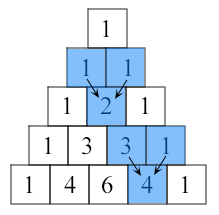

# Zadania 5 - funkcje

Napisz funkcję, która:

`l = [21, 31, 12, 98, -1, -23, -23, 21, 98]`

1. `moj_max(a, b, c)`, która znajdzie maksimum z 3 liczb.
2. `pole_kola(r)`, która zwróci pole koła o promieniu `r`.
3. `moja_suma(l)` , która zsumuje wszystkie liczby w liście `l`.
4. `moj_iloczyn(l)`, która wymnoży wszystkie liczby w liście `l`.
5. `czy_w_zakresie1(x, a, b)`, która sprawdzi czy `x` znajduje się w zakresie `[a, b]`.
6. `czy_w_zakresie2(x, a, b)`, która sprawdzi czy `x` znajduje się w zakresie `(a, b)`.
7. `tylko_unikalne(l)`, która zwróci listę złożoną tylko z unikalnych wartości `l`.
8. `minmax(l)`, która zwróci krotkę `(mi, ma)` -- minimalny i maksymalny element w liście.
9. `cumsum(l)`, która policzy sumy częściowe z elementów listy `l`.
10. `czy_pierwsza(x)`, która sprawdzi czy liczba `a` jest pierwsza. Liczba jest pierwsza, jeżeli jest podzielna tylko przez 1 i przez samą siebie.
11. `czynniki(n)`, która rozłoży `n` na czynniki pierwsze i wypisze je na ekran.
12. `ile_jakich(s)`, która wypisze na ekran liczbę wielkich liter oraz liczbę małych liter w napisie `s`.
13. `rysuj_trojkat_P(n)`, która wypisze na ekran pierwsze `n` wierszy trójkąta Pascala.
14. `sito_erastotenesa(n)`, która zwróci listę wszystkich liczb pierwszych z zakresu od 2 do n.
15. `bin_search(t, x)`, która zwróci indeks pod którym znajduje się `x` w liście `t` , lub -1 gdy nie występuje. Lista `t` jest posortowana.

